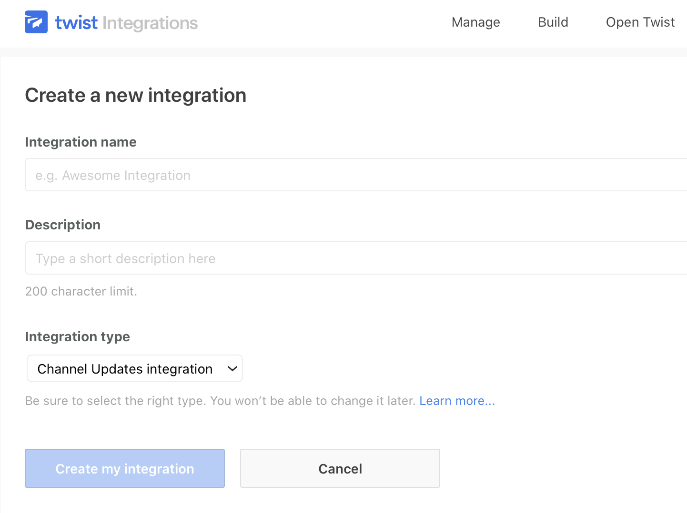
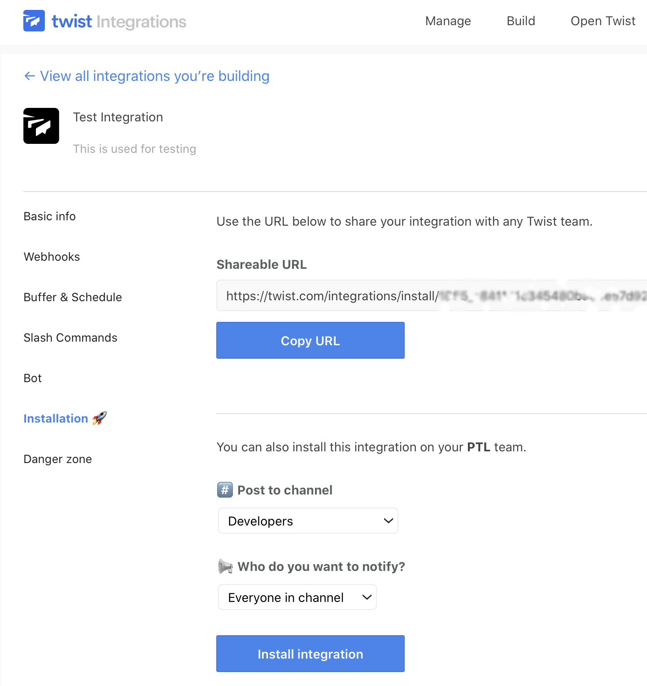

.. _how-to:

******
How To
******

Create a New Command Overlay
============================

:ref:`topics-overlays` are used to define the commands supported by a given application, service, or operating system. Commands are defined as a function.

1) Define a Module
------------------

The first step is to create a new module in which functions will be defined.

.. code-block:: python

    # module_name.py
    from ..commands import Command

For overlays that represent an operating system, the ``command_exists()`` function is required:

.. code-block:: python

    def command_exists(name):
        return name in MAPPINGS

2) Define Command Function
--------------------------

The purpose of each function is to provide an interface for instantiating a :py:class:`scripttease.library.commands.base.Command` instance. The example below is taken from the ``posix`` module.

.. code-block:: python

    # module_name.py
    # ...

    def mkdir(path, mode=None, recursive=True, **kwargs):
        """Create a directory.

        - path (str): The path to be created.
        - mode (int | str): The access permissions of the new directory.
        - recursive (bool): Create all directories along the path.

        """
        kwargs.setdefault("comment", "create directory %s" % path)

        statement = ["mkdir"]
        if mode is not None:
            statement.append("-m %s" % mode)

        if recursive:
            statement.append("-p")

        statement.append(path)

        return Command(" ".join(statement), **kwargs)

The arguments and any specific keyword arguments are automatically used by the parser, but also serve as a simple interface for programmatic use.

Each function *must* also accept ``**kwargs`` and should set a default for ``comment`` as above.

.. important::
    Rather than the usual Spinx-based documentation, define the docstring as shown above. This is used to automatically create the documentation for the command.

3) Add Functions to the Mapping
-------------------------------

The final step adds the function to the mapping. This makes it available to the command factory.

.. code-block:: python

    # module_name.py
    # ...

    MAPPINGS = {
        'mkdir': mkdir,
    }

For overlays that represent an operating system, ``MAPPINGS`` is required -- in addition to ``command_exists()`` above. For commands that are specific to service or application, the name of the dictionary may be anything that is appropriate. For example, ``DJANGO_MAPPINGS``.

Additionally, for an operating system overlay, you may wish to import other mappings and incorporate them into ``MAPPINGS``.

.. code-block:: python

    # module_name.py
    from ..commands import Command
    from .common import COMMON_MAPPINGS
    from .django import DJANGO_MAPPINGS
    from .pgsql import PGSQL_MAPPINGS

    MAPPINGS = {
        # ...
    }

    MAPPINGS.update(COMMON_MAPPINGS)
    MAPPINGS.update(DJANGO_MAPPINGS)
    MAPPINGS.update(PGSQL_MAPPINGS)

4) Update Documentation
-----------------------

Add the command mappings to the ``docs/generate_command_signatures.py`` file. See the script for more details.

Export Commands as a Script
===========================

You can export commands as a read-to-use script. For example:

.. code-block:: python

    config = Config("commands.ini")
    if not config.load():
        print("Bummer!")
        exit()

    script = config.as_script()
    print(script)

Post a Message to Slack
=======================

The slack function may be used to send a message to a Slack channel. This uses the Incoming Webhooks feature, which requires some additional setup.

.. note::
    The following steps were accurate as of September 2020.

**1.** Log in to Slack and go to `Your Apps`_.

.. _Your Apps: https://api.slack.com/apps

**2.** Create a new Slack app.

**3.** On the next page, select Incoming Webhooks and then toggle activation.

.. image:: /_static/images/slack-1.jpg

**4.** Next click Add new Webhook to Workspace and select the channel to which the message will be posted.

.. image:: /_static/images/slack-2.jpg

.. image:: /_static/images/slack-3.jpg

**5.** Copy the URL for the new webhook to use as the ``url`` parameter for the Slack command.

.. code-block:: ini

    [send a message to slack]
    slack: "This is a test message."
    url: the URL you created goes here

Post a Message to Twist
=======================

The twist function may be used to send a message to Twist, which requires some additional setup.

.. note::
    The following steps were accurate as of September 2020.

**1.** Log in to Twist and from the profile menu go to Add Integrations. Then click on Build and "Add a new integration".

**2.** Provide the requested info.

**3.** After submitting this info, go to Installation. Select a channel and who to notify. Then click "Install integration".

**4.** Copy the "Post content manually" URL for use in your configuration file.

.. code-block:: ini

    [post a message to twist]
    twist: "This is a test message."
    url: the URL you created goes here
